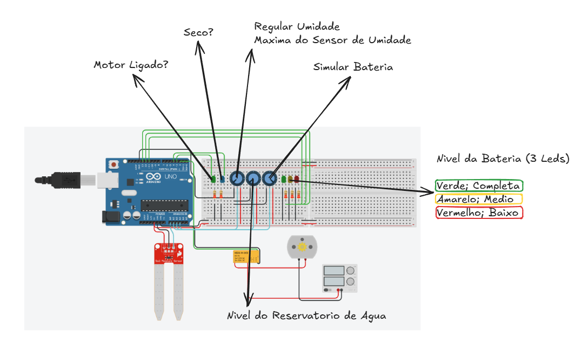

# Código Arduino — Regadeira

Projeto de simulação desenvolvido para as disciplinas de Microcontroladores e Biologia.

## Ligação dos pinos

| Componente                        | Pino |
| --------------------------------- | ---- |
| Motor                             | 2    |
| LED do motor                      | 3    |
| LED de umidade baixa              | 4    |
| LED bateria baixa                 | 11   |
| LED bateria média                | 12   |
| LED bateria alta                  | 13   |
| Potenciômetro da bateria         | A1   |
| Potenciômetro do reservatório   | A2   |
| Potenciômetro da umidade máxima | A3   |
| Sensor de umidade do solo         | A0   |

Como não tínhamos como variar a bateria ou o nível de água de verdade, usamos os potenciômetros para simular esses valores (tinkercard).

## Como o código funciona

No `setup()`, definimos os pinos do motor e dos LEDs como saída, começamos com tudo desligado e iniciamos a comunicação serial.

No `loop()`, usamos `millis()` para não travar o programa. Existem dois tempos principais:

- `SensorReadInterval = 120000`: leitura normal dos sensores a cada 2 minutos.
- `WateringDuration = 10000`: rega de 10 segundos quando o motor liga.
- `PostWateringCheckDelay = 20000`: espera de 20 segundos depois de cada rega antes de verificar novamente a umidade.

Tempos reduzidos para facilitar os testes da simulação. Em uma aplicação real, os intervalos podem ser ajustados conforme a necessidade da planta e do sistema de irrigação. Os LEDs da bateria são atualizados continuamente, inclusive enquanto o programa aguarda uma nova leitura de umidade.

Todas as leituras analógicas (0 a 1023) são convertidas para 0 a 100% com `map()` e limitadas com `constrain()`.

## Lógica do sistema

Comparamos a umidade atual do solo com a umidade máxima ajustada no potenciômetro:

```cpp
bool soilIsDry = humidityLevel < maxHumidity;
```

Se o valor atual for menor que o desejado, entendemos que o solo está seco e acendemos o LED de umidade baixa.

### Condições para irrigação

O motor só liga quando as três condições acontecem juntas:

```cpp
bool motorOn = soilIsDry && enoughWater && enoughBattery;
```

1. Solo seco.
2. Reservatório com algum nível de água (`reservatoryLevel > 0`).
3. Bateria com algum nível de carga (`batteryLevel > 0`).

Quando rega, o programa grava o momento de início e usa a variável `watering` para contar os 10 segundos sem usar `delay()`.

Os LEDs de bateria são atualizados a cada passagem pelo `loop()`. Assim, eles refletem as alterações no potenciômetro da bateria mesmo durante os 2 minutos entre as leituras normais, durante a rega e durante a espera de 20 segundos.

Ao terminar os 10 segundos de rega, o motor é desligado e o programa espera 20 segundos antes de fazer uma verificação especial da umidade. Essa verificação é independente do intervalo normal de 2 minutos. Nela, o programa verifica novamente se a umidade do solo atingiu o valor desejado:

- Se a umidade já atingiu o nível desejado, o motor permanece desligado.
- Se o solo ainda estiver seco, o motor liga novamente por mais 10 segundos.

Depois dos 20 segundos, o monitor serial informa que a verificação posterior começou. Se o solo ainda estiver seco e houver água e bateria, o ciclo de rega é repetido. Se a umidade desejada tiver sido atingida, o programa informa o resultado e volta a aguardar o próximo `SensorReadInterval` de 2 minutos antes de fazer a verificação normal. Se faltar água ou bateria, o programa também informa o motivo pelo qual não pode regar novamente.

### Monitoramento e LEDs

- **Bateria:** alta com 70% ou mais, média de 30% a 69%, baixa abaixo disso.
- **Motor:** o LED do motor acompanha o estado do motor (Ligado/Desligado).
- **Monitor serial:** mostra bateria, umidade do solo, umidade máxima, reservatório e estado do motor.



